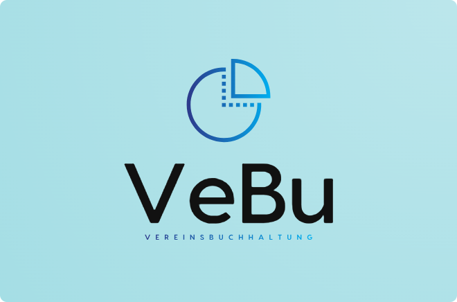

# VeBu - Die Vereinsbuchhaltung

VeBu ist ein einfaches Buchhaltungsprogramm zur Unterstützung von kleinen gemeinnützigen Vereinen. Das Programm ermöglicht laufende Geschäftsvorfälle zu erfassen und daraus eine Einnahmen-Überschuss-Rechnung inkl. Vermögensnachweis zu erstellen. Das Programm soll die oft üblichen Excel-Tabellen ersetzen und somit mehr Ordnung in die Vereinsbuchhaltung bringen. 
 
Dieses Projekt ist im Rahmen einer Masterarbeit im Studiengang Master of Taxation an der Hochschule München entstanden. Das Projekt wird unter der GPL v3 als Open Source lizenziert. Die Hinweise und Richtlinien der GPL v3 sind einzuhalten. Zu beachten ist, dass der vollständige Haftungsausschluss der GPL v3 nach deutschem Recht nicht gültig ist. Es gelten die gesetzlichen Regelungen. Auf den Inhalt, insbesondere die Richtigkeit, Vollständigkeit und Aktualität der bereit gestellten Informationen kann keine Haftung übernommen werden. Die aktuelle Version v0.0.1 ist ein Prototyp, der noch nicht voll funktionsfähig ist. Jeder ist eingeladen, zu dem Projekt beizutragen. Fragen, Wünsche und Anregungen werden gerne angenommen. 
 
Das Projekt basiert auf dem QT Framework in der Version 6.5 LTS. Das QT Framework ist ebenfalls unter der GPL v3 lizenziert. Es wird nicht mit dem Quellcode von VeBu mitgeliefert. Die Lizenzbedingungen von QT sind einzuhalten. Desweiteren wird als Datenbanksystem SQLLite verwendet. Dieses wird der Public Domain frei zur Verfügung gesetellt. 
 
<b>Installationshinweise:</b> 
Das Programm wird fertig kompiliert im Ordner "dist" bereitgestellt. Es kann auf Windows Systemen (Windows 10/11) sowie macOS ausgeführt werden.  
 
